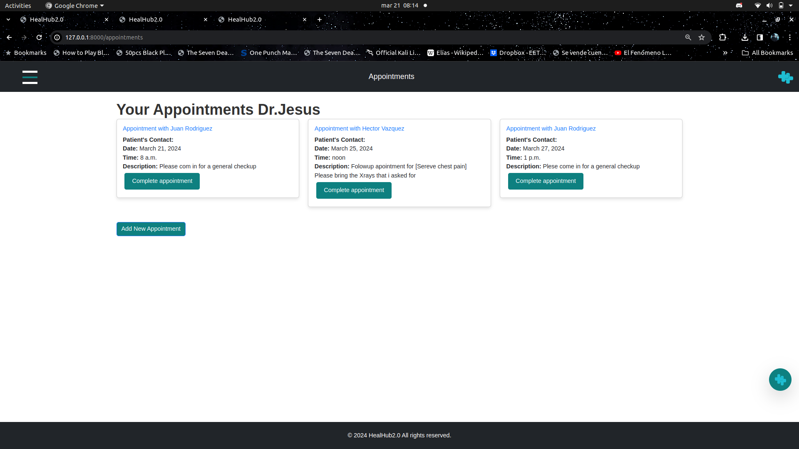

## Description

Welcome to HealHub 2.0, your premier destination for seamless medical appointment
bookings. With HealHub 2.0, you gain access to a comprehensive network of esteemed
doctors, enabling you to effortlessly schedule appointments across a variety of specialties.
Our intuitive platform also offers unique features: a built-in AI consultant and a doctor finder designed to guide
you in selecting the ideal medical professional for your specific health concern. Whether
you're seeking a specialist nearby or need advice on the type of doctor to consult, HealHub 2.0
simplifies your healthcare journey, ensuring you receive the care you need, when you need it.

## Table of Contents

- [Usage](#usage)
- [Features](#features)
- [Contributing](#contributing)
- [License](#license)

## Usage

### When first accesing HealHub2.0 you will be greeted with the landinng page:

### After creating an account, you will be able to access the full page:
#### Here you can search for doctros in your are and also interact with our AI consultant.

### You can click the top left button to acces the popup menu, where you see all the available pages:
### You can acces the appointments page from there:
#### You can see all your current appintments as well af create new ones by clicking the "Create Appointment" button.

## Features

- Online appointment booking
- Doctor profiles and specializations
- User account creation and management

## Team members and roles
- Jesus Mendez - Lead Developer
- Guillermo Pereyo - Frontend Developer
- Juan Rodriguez - Frontend developer
- Joshua Santiago - Backend Developer
